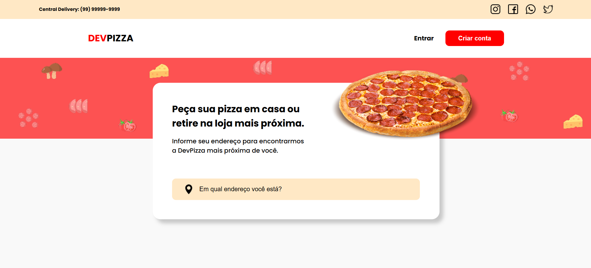

# 🍕 DevPizza  

> Landing page de uma pizzaria fictícia chamada **DevPizza**, desenvolvida com HTML e CSS.  

## 📸 Imagem do Projeto  
  

## 🔗 Acesse o Projeto  
🔗 [DevPizza - Live Site](https://devpizza-theta.vercel.app/)  

## 🛠️ Tecnologias Utilizadas  
- HTML5  
- CSS3  

## 📦 Como visualizar o projeto localmente  
```bash
# Clone o repositório
git clone https://github.com/fcdias0812/DevPizza

# Acesse a pasta do projeto
cd DevPizza

# Abra o arquivo index.html no navegador
```

## 🎯 Aprendizados  
Esse foi o primeiro projeto que desenvolvi completamente sozinho, sem auxílio, o que me permitiu treinar e aprofundar meus conhecimentos em:  
✔️ Estruturação de páginas com HTML  
✔️ Estilização avançada com CSS  
✔️ Posições relativas e absolutas  
✔️ Responsividade para diferentes telas  

## 📞 Contato  
📧 Email: dias.fabricio0812@gmail.com  
💼 LinkedIn: [Acesse meu LinkedIn](https://www.linkedin.com/in/fcdias0812/)  
👨🏻‍💻 devChallenges: [Acesse meu devChallenges](https://devchallenges.io/profile/ddc059be-9eb4-40fb-b8cd-6f8dcd32b468)  
